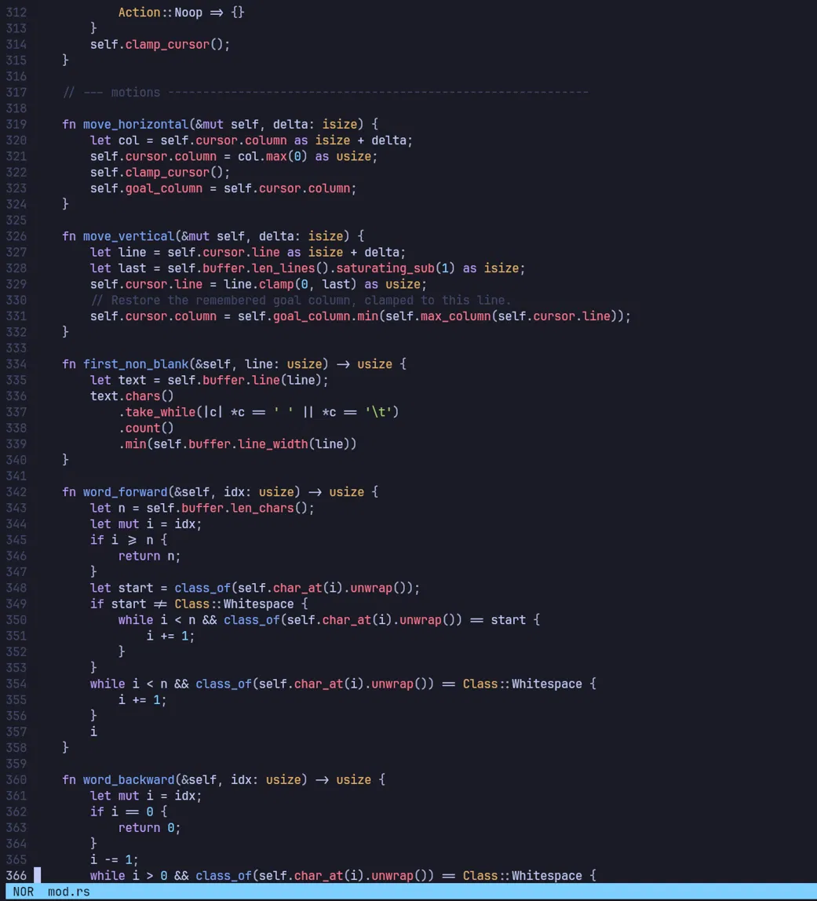

<h1 align="center">Lux</h1>

<p align="center">
  A modal, <a href="https://helix-editor.com/">Helix</a>-inspired terminal text editor, written from scratch in Rust.
</p>

<p align="center">
  
  
</p>

---

**Lux** is a small but real text editor. The interesting parts, the text data
structure, the syntax engine, the undo system, the language-server client, are
all built by hand rather than pulled off the shelf, so the goal of the project
is to *understand* how an editor works, not just to use one.

It is modal like Vim/Helix (normal / insert / visual), highlights code with
tree-sitter, re-parses incrementally as you type, and talks to `rust-analyzer`
over a hand-written LSP client for live diagnostics and completion.

## Demo



## Features

Everything here is implemented from scratch unless noted:

#### Internals
- **Rope** text buffer: a balanced binary tree of text chunks, so edits are
  `O(log n)` instead of `O(n)`. Character-indexed (never byte-indexed) with
  cached line/char metrics and Fibonacci-criterion rebalancing.
- **Syntax highlighting** via [tree-sitter]: a real parser, not regex.
- **Incremental parsing**: after each edit only the changed range is re-parsed,
  reusing the rest of the syntax tree.

#### Systems
- **LSP client**: a from-scratch JSON-RPC client (including its own JSON
  parser) speaking to `rust-analyzer` for diagnostics and completion.
- **Undo/redo tree**: history is a tree, not a stack, so undoing and then typing
  never throws away a branch (like Vim's `undotree`).
- **Modal editing**: normal / insert / visual modes with Vim-style motions,
  plus a `:` command line (`:w`, `:q`, `:wq`, …).

#### Polish
- Line-number gutter, visual selection, mode-aware cursor shape, status line.
- Tested (92 tests) and documented (see [`ARCHITECTURE.md`](ARCHITECTURE.md) and
  the build log in [`JOURNEY.md`](JOURNEY.md)).

[tree-sitter]: https://tree-sitter.github.io/

## Installing & running

Lux needs a Rust toolchain (1.88+, for let-chains) and a C compiler
(tree-sitter grammars are C). Install it onto your `PATH` with cargo:

```sh
cargo install --path .
```

This drops the binary in `~/.cargo/bin`, so make sure that directory is on your
`PATH` (cargo prints a warning if it isn't; rustup users already have it).
Then `lux` is a command you can run from anywhere, like `vim` or `hx`:

```sh
lux              # open an empty scratch buffer
lux file.rs      # open a file (it's created on save if it doesn't exist yet)
```

For diagnostics and completion, make sure `rust-analyzer` is also on your
`PATH`; without it, lux simply runs without LSP.

#### Trying it without installing

From a clone of the repo:

```sh
cargo run -- file.rs
```

#### With Nix

If you use Nix, a flake provides the toolchain and the editor: a dev shell, a
runnable app, and an installable package (with `rust-analyzer` wired onto the
binary's runtime path):

```sh
nix develop                 # dev shell with rustc/cargo/rust-analyzer
nix run . -- file.rs        # run it without installing
nix profile install .       # install `lux` onto your PATH
```

## Keys

Normal mode (Vim-like):

| Keys            | Action                          |
| --------------- | ------------------------------- |
| `h` `j` `k` `l` | move left / down / up / right   |
| `w` `b`         | next / previous word            |
| `0` `$`         | start / end of line             |
| `gg` `G`        | start / end of buffer           |
| `i` `a`         | insert before / after cursor    |
| `I` `A`         | insert at line start / end      |
| `o` `O`         | open line below / above         |
| `v`             | visual mode                     |
| `x` `dd`        | delete char / line              |
| `u` `U`         | undo / redo                     |
| `p`             | paste                           |
| `:`             | command line (see below)        |
| `Ctrl-s`        | save                            |
| `Ctrl-q`        | quit (`Ctrl-x` to force)        |

Insert mode: type to insert, `Esc` to return to normal, `Ctrl-n` for completion.

Visual mode: motions extend the selection; `d`/`x` delete, `y` yank, `Esc`/`v`
to leave.

Command mode (`:`), Vim-style. `Enter` runs the command, `Esc` cancels:

| Command       | Action                 |
| ------------- | ---------------------- |
| `:w`          | write (save)           |
| `:q`          | quit (blocked if dirty)|
| `:q!`         | force quit             |
| `:wq` / `:x`  | write and quit         |

## Language support

Syntax highlighting and the language-server features are wired up for **Rust
only** right now. The tree-sitter grammar and `rust-analyzer` are both
Rust-specific. Other files still open and edit fine, just as plain text.

Open a `.rs` file inside a Cargo project (a directory with a `Cargo.toml`) and,
if `rust-analyzer` is on your `PATH`, lux starts it automatically:

- **Diagnostics**: once rust-analyzer finishes indexing (a moment on first
  open), errors and warnings are marked in the line-number gutter and the
  message for the cursor's line shows in the status bar.
- **Completion**: completion is *manual* (it isn't triggered as you type). In
  insert mode, type a partial name and press `Ctrl-n` to ask rust-analyzer for
  candidates; a popup opens below the cursor. `Ctrl-n` / `Down` / `Tab` and
  `Ctrl-p` / `Up` move the selection (it wraps around), `Enter` accepts
  (inserting only the part you haven't typed yet), and `Esc` dismisses it. If
  rust-analyzer is still indexing or has nothing to offer, the status bar shows
  `no completions`.

If `rust-analyzer` isn't installed, lux just runs without diagnostics and
completion. Editing and highlighting still work.

## Architecture

The code is layered so each module only depends on the ones below it:

```
editor  →  text → rope        the buffer and its data structure
        →  history            undo/redo tree
        →  syntax             tree-sitter highlighting
        →  lsp                language-server client
        →  ui                 rendering
```

One keystroke flows in a straight line: the terminal hands `app` an event,
`input` turns it into an `Action`, `editor.apply_action` mutates the buffer and
cursor, and `ui::render` paints the result. See [`ARCHITECTURE.md`](ARCHITECTURE.md)
for the module-by-module tour, and [`JOURNEY.md`](JOURNEY.md) for *why* each
piece is built the way it is.

## Testing

```sh
cargo test          # 87 unit + 4 integration (+1 ignored live)
cargo clippy        # lint clean
```

Highlights: the rope is fuzz-tested against a plain `String` reference, the undo
tree has a test proving branches survive, and the JSON/transport layers are
tested with in-memory pipes.

## Status & limitations

Lux is a focused learning project, not a daily driver. Known limitations:
single buffer/window, full-document LSP sync, no search/replace or config file
yet, and the rope rebalances by rebuilding rather than rotating. These are
deliberate trade-offs to keep each subsystem small and readable.
